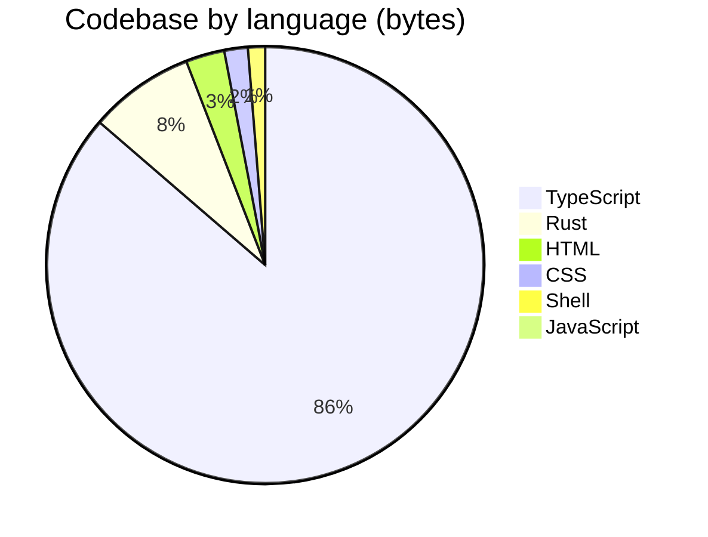

<p align="center">
  <a href="https://open330.github.io">
    
  </a>
</p>

<p align="center">
  <strong>Building professional services powered by LLM AI agents</strong>
</p>

<p align="center">
  <a href="https://open330.github.io">Website</a> · <a href="https://github.com/orgs/open330/repositories">Repositories</a>
</p>

<p align="center">
  
  
  
  
</p>

---

We are a group of engineers who build at 3:30 AM.

**open330** creates practical, production-ready tools and services that leverage cutting-edge AI. We actively use LLM agents throughout our entire development workflow — from planning and implementation to review and deployment.

### 🤖 AI-only code changes

> **Human must NEVER write, modify, or touch any code. Not even a single line.**

All code in our repositories is written exclusively by AI agents. Humans describe requirements, review outputs, and approve changes — but never touch the code directly. If a human pastes code, it is treated as a rough intent description and rewritten from scratch by an agent.

### ⏰ When we code

Commit activity across all public repositories (KST, UTC+9):

```
 12 AM  ███░░░░░░░░░░░░░░░░░  6
  1 AM  ████░░░░░░░░░░░░░░░░  7
  2 AM  ██░░░░░░░░░░░░░░░░░░  4
  3 AM  ██████░░░░░░░░░░░░░░ 12  <-- 3:30 AM
  4 AM  ████░░░░░░░░░░░░░░░░  7
  5 AM  ███████░░░░░░░░░░░░░ 14
  6 AM  ███████░░░░░░░░░░░░░ 13
  7 AM  ██████░░░░░░░░░░░░░░ 11
  8 AM  ██░░░░░░░░░░░░░░░░░░  3
  9 AM  ████████████████████ 40
 10 AM  ██░░░░░░░░░░░░░░░░░░  4
 11 AM  ███░░░░░░░░░░░░░░░░░  5
 12 PM  ████████░░░░░░░░░░░░ 16
  1 PM  ██░░░░░░░░░░░░░░░░░░  3
  2 PM  █░░░░░░░░░░░░░░░░░░░  1
  3 PM  ·                     0
  4 PM  ·                     0
  5 PM  ·                     0
  6 PM  ·                     0
  7 PM  █░░░░░░░░░░░░░░░░░░░  2
  8 PM  ███████░░░░░░░░░░░░░ 13
  9 PM  ·                     0
 10 PM  █░░░░░░░░░░░░░░░░░░░  1
 11 PM  ██░░░░░░░░░░░░░░░░░░  4
```

| Period | Hours | Commits | Share |
|--------|-------|--------:|------:|
| 🌙 Deep night | 12–5 AM | 50 | 30% |
| 🌅 Dawn | 6–8 AM | 27 | 16% |
| ☀️ Morning | 9 AM–12 PM | 65 | 39% |
| 🌤️ Afternoon | 1–6 PM | 4 | 2% |
| 🌆 Evening | 7–11 PM | 20 | 12% |

> **46%** of all commits land between midnight and 8 AM. The name isn't ironic.

### 💻 Tech stack



<p>
  
  
  
  
  
  
  
</p>

### 🏆 Top contributors

| | Contributor | Commits | |
|---|---|---:|---|
|  | [@jiunbae](https://github.com/jiunbae) | 122 | `████████████████████` |
|  | [@hletrd](https://github.com/hletrd) | 71 | `████████████░░░░░░░░` |
|  | [@cheon7886](https://github.com/cheon7886) | 5 | `█░░░░░░░░░░░░░░░░░░░` |

### 🏗️ Projects

| Project | Stack | Description |
|---------|-------|-------------|
| 🤖 [**open-agent-contribution**](https://github.com/open330/open-agent-contribution) |  | Use leftover AI agent tokens to auto-contribute to GitHub repos |
| 🗺️ [**travelback**](https://github.com/open330/travelback) |   | Animate GPX, KML, and Google Location History into travel videos |
| 📸 **BurstPick** |   | AI-powered burst photo culling for photographers |
| 🌐 [**BurstPick-web**](https://github.com/open330/BurstPick-web) |   | Official website for BurstPick |
| 📦 [**BurstPick-releases**](https://github.com/open330/BurstPick-releases) | | DMG downloads, Sparkle appcast, and update artifacts for macOS |
| 🧰 [**agt**](https://github.com/open330/agt) |  | A modular toolkit for extending AI coding agents |
| 🧠 **ConText** | | AI-powered personal knowledge assistant — chat-style memo service |
| 💡 **MaC** | | Mind as Context |

### 👥 Team

| <a href="https://github.com/jiunbae"></a> | <a href="https://github.com/codingskynet"></a> | <a href="https://github.com/hletrd"></a> | <a href="https://github.com/cheon7886"></a> | <a href="https://github.com/Overlaine-00"></a> | <a href="https://github.com/leejseo"></a> | <a href="https://github.com/circle-oo"></a> |
|:---:|:---:|:---:|:---:|:---:|:---:|:---:|
| [jiunbae](https://github.com/jiunbae) | [codingskynet](https://github.com/codingskynet) | [hletrd](https://github.com/hletrd) | [cheon7886](https://github.com/cheon7886) | [Overlaine-00](https://github.com/Overlaine-00) | [leejseo](https://github.com/leejseo) | [circle-oo](https://github.com/circle-oo) |
