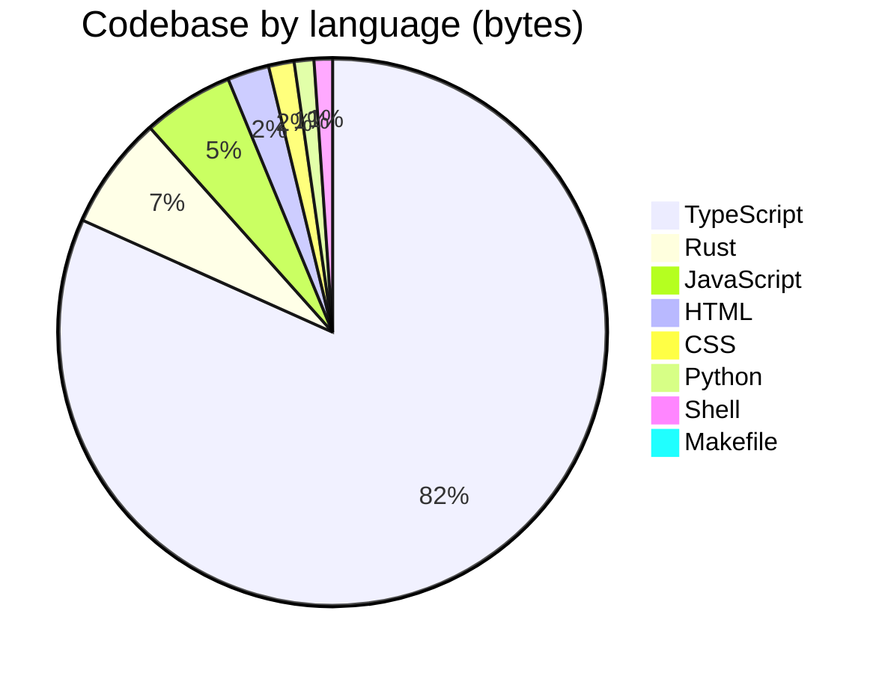

<p align="center">
  <a href="https://open330.github.io">
    
  </a>
</p>

<p align="center">
  <strong>Building professional services powered by LLM AI agents</strong>
</p>

<p align="center">
  <a href="https://open330.github.io">Website</a> · <a href="https://github.com/orgs/open330/repositories">Repositories</a>
</p>

<p align="center">
  
  
  
  
  
</p>

---

We are a group of engineers who build at 3:30 AM.

**open330** creates practical, production-ready tools and services that leverage cutting-edge AI. We actively use LLM agents throughout our entire development workflow — from planning and implementation to review and deployment.

### 🤖 AI-only code changes

> **Human must NEVER write, modify, or touch any code. Not even a single line.**

All code in our repositories is written exclusively by AI agents. Humans describe requirements, review outputs, and approve changes — but never touch the code directly. If a human pastes code, it is treated as a rough intent description and rewritten from scratch by an agent.

### ⏰ When we code

Commit activity across all repositories (KST, UTC+9):

```
 12 AM  ███░░░░░░░░░░░░░░░░░ 10
  1 AM  ██░░░░░░░░░░░░░░░░░░  7
  2 AM  █░░░░░░░░░░░░░░░░░░░  4
  3 AM  ███████░░░░░░░░░░░░░ 21  <-- 3:30 AM
  4 AM  ███░░░░░░░░░░░░░░░░░  8
  5 AM  ██████░░░░░░░░░░░░░░ 19
  6 AM  █████░░░░░░░░░░░░░░░ 15
  7 AM  ████░░░░░░░░░░░░░░░░ 13
  8 AM  ██░░░░░░░░░░░░░░░░░░  5
  9 AM  ████████████████████ 60
 10 AM  ██████████░░░░░░░░░░ 30
 11 AM  ████░░░░░░░░░░░░░░░░ 13
 12 PM  ████████░░░░░░░░░░░░ 23
  1 PM  █░░░░░░░░░░░░░░░░░░░  3
  2 PM  █░░░░░░░░░░░░░░░░░░░  1
  3 PM  ·                     0
  4 PM  ·                     0
  5 PM  ·                     0
  6 PM  ·                     0
  7 PM  ██░░░░░░░░░░░░░░░░░░  5
  8 PM  ████░░░░░░░░░░░░░░░░ 13
  9 PM  ·                     0
 10 PM  █░░░░░░░░░░░░░░░░░░░  1
 11 PM  █░░░░░░░░░░░░░░░░░░░  4
```

| Period | Hours | Commits | Share |
|--------|-------|--------:|------:|
| 🌙 Deep night | 12–5 AM | 69 | 27% |
| 🌅 Dawn | 6–8 AM | 33 | 13% |
| ☀️ Morning | 9 AM–12 PM | 126 | 49% |
| 🌤️ Afternoon | 1–6 PM | 4 | 2% |
| 🌆 Evening | 7–11 PM | 23 | 9% |

> **40%** of all commits land between midnight and 8 AM. The name isn't ironic.

### 📊 Lines of code

| Language | Files | Code | Comments | Blanks |
|----------|------:|-----:|---------:|-------:|
| TypeScript | 162 | 27,093 | 1,054 | 4,026 |
| Markdown | 141 | 16,474 | 0 | 5,451 |
| JSON | 36 | 6,724 | 0 | 7 |
| Rust | 17 | 2,396 | 176 | 321 |
| JavaScript | 14 | 1,647 | 22 | 120 |
| CSS | 3 | 662 | 28 | 134 |
| HTML | 2 | 529 | 0 | 24 |
| YAML | 9 | 464 | 3 | 75 |
| Python | 1 | 345 | 10 | 26 |
| Shell | 2 | 311 | 49 | 60 |
| SVG | 22 | 288 | 11 | 32 |
| License | 3 | 51 | 0 | 12 |
| Makefile | 1 | 26 | 7 | 7 |
| TOML | 1 | 25 | 0 | 2 |
| **Total** | **414** | **57,035** | **1,360** | **10,297** |

### 💻 Tech stack



<p>
  
  
  
  
  
  
  
</p>

### 🏆 Top contributors

| | Contributor | Commits | |
|---|---|---:|---|
|  | [@jiunbae](https://github.com/jiunbae) | 18 | `████████████████████` |
|  | [@claude](https://github.com/claude) | 10 | `███████████░░░░░░░░░` |
|  | [@hletrd](https://github.com/hletrd) | 7 | `████████░░░░░░░░░░░░` |

### 🏗️ Projects

| Project | Stack | Description |
|---------|-------|-------------|
| 🤖 [**open-agent-contribution**](https://github.com/open330/open-agent-contribution) |  | Use your leftover AI agent tokens to automatically contribute to GitHub repositories |
| 📦 [**BurstPick-releases**](https://github.com/open330/BurstPick-releases) |  | Official release distribution for BurstPick — DMG downloads, Sparkle appcast, and update artifacts for macOS |
| 🌐 [**BurstPick-web**](https://github.com/open330/BurstPick-web) |   | Official website for BurstPick — AI-powered burst photo culling app for photographers. Built with Next.js 16, React 19, Tailwind CSS & Framer Motion. |
| 🧰 [**agt**](https://github.com/open330/agt) |  | A modular toolkit for extending AI coding agents |
| 🗺️ [**travelback**](https://github.com/open330/travelback) |   | Animate GPX, KML, and Google Location History into travel videos |
| 📁 [**quickstart-for-agents**](https://github.com/open330/quickstart-for-agents) |  |  |
| 📸 **BurstPick** |   | AI-powered burst photo culling for photographers |
| 🧠 **ConText** |  | AI-powered personal knowledge assistant — chat-style memo service |
| 💡 **MaC** |  | Mind as Context |

### 👥 Team

| <a href="https://github.com/hletrd"></a> | <a href="https://github.com/jiunbae"></a> |
|:---:|:---:|
| [hletrd](https://github.com/hletrd) | [jiunbae](https://github.com/jiunbae) |
