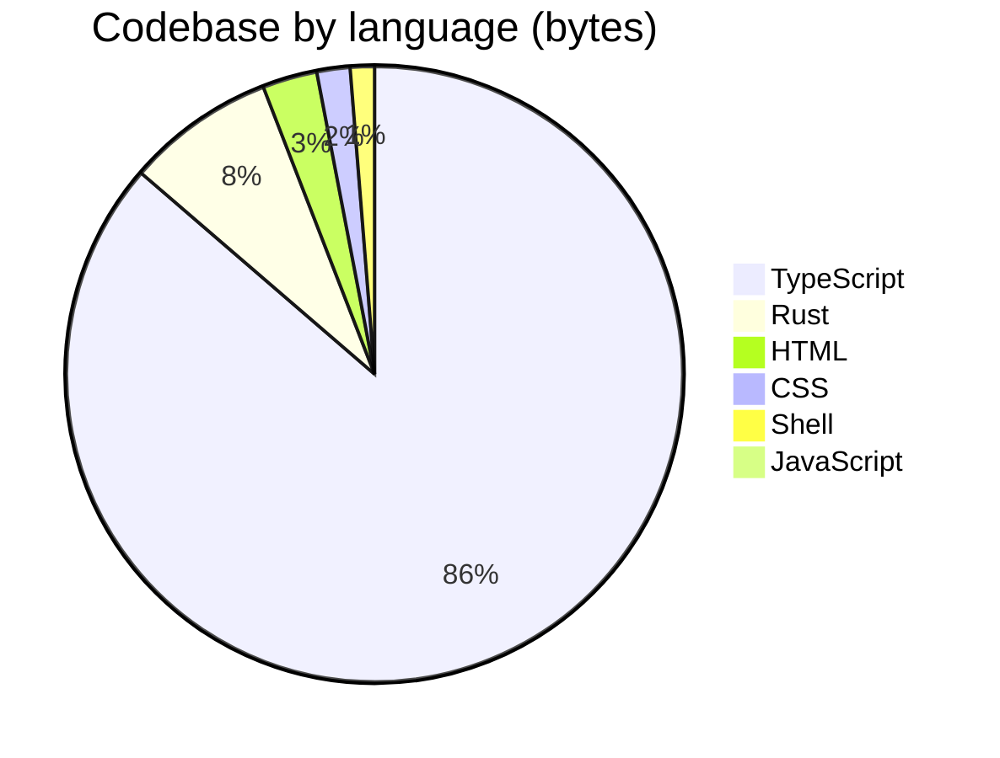

<div align="center">

<a href="https://open330.github.io">
  
</a>

<br>
<br>

**Building professional services powered by LLM AI agents**

*We build at 3:30 AM — and we don't write a single line of code.*

<br>

<a href="https://open330.github.io">
  
</a>&nbsp;
<a href="https://github.com/orgs/open330/repositories">
  
</a>

<br>
<br>


</div>

<br>

<div align="center">
<table><tr><td>
<br>

&nbsp; 🤖 &nbsp; **Every line of code in our repositories is written exclusively by AI agents.** &nbsp;
<br>
&nbsp; Humans describe requirements, review outputs, and approve changes — but never touch the code. &nbsp;

<br>
</td></tr></table>
</div>

<br>

## About

**open330** is a team of engineers who ship production-ready tools and services powered by cutting-edge AI. We leverage LLM agents across our entire development lifecycle — from planning and architecture through implementation, review, and deployment.

The name comes from 3:30 AM — when nearly half our commits land.

<br>

## Featured Projects

<table>
<tr>
<td width="50%" valign="top">

<h3><a href="https://github.com/open330/agt">🧰 agt</a></h3>

A modular toolkit for extending AI coding agents with custom skills, personas, and workflows.

<br>


</td>
<td width="50%" valign="top">

<h3><a href="https://github.com/open330/open-agent-contribution">🤖 open-agent-contribution</a></h3>

Use leftover AI agent tokens to automatically contribute to open-source GitHub repos.

<br>


</td>
</tr>
<tr>
<td width="50%" valign="top">

<h3><a href="https://github.com/open330/travelback">🗺️ travelback</a></h3>

Animate GPX, KML, and Google Location History into beautiful travel replay videos.

<br>


</td>
<td width="50%" valign="top">

<h3>📸 BurstPick</h3>

AI-powered burst photo culling for photographers. One-tap best shot selection using on-device ML.

<br>


&nbsp;
<a href="https://github.com/open330/BurstPick-web"><sub>Website</sub></a> · <a href="https://github.com/open330/BurstPick-releases"><sub>Releases</sub></a>

</td>
</tr>
<tr>
<td width="50%" valign="top">

<h3>🧠 ConText</h3>

AI-powered personal knowledge assistant — a chat-style memo service that understands context.

</td>
<td width="50%" valign="top">

<h3>💡 MaC</h3>

Mind as Context — turning thoughts into structured, retrievable knowledge.

</td>
</tr>
</table>

<br>

## Tech Stack

<p>
  
  
  
  
  
  
  
  
  
</p>

<details>
<summary><b>Codebase breakdown by language</b></summary>
<br>



</details>

<br>

## When We Code

Commit activity across all repositories (KST, UTC+9):

```
                        ·    ·    ·    ·    ·
 12 AM  ███░░░░░░░░░░░░░░░░░   6
  1 AM  ████░░░░░░░░░░░░░░░░   7
  2 AM  ██░░░░░░░░░░░░░░░░░░   4
  3 AM  ██████░░░░░░░░░░░░░░  12  ← 3:30 AM
  4 AM  ████░░░░░░░░░░░░░░░░   7
  5 AM  ███████░░░░░░░░░░░░░  14
  6 AM  ███████░░░░░░░░░░░░░  13
  7 AM  ██████░░░░░░░░░░░░░░  11
  8 AM  ██░░░░░░░░░░░░░░░░░░   3
  9 AM  ████████████████████  40  ← peak
 10 AM  ██░░░░░░░░░░░░░░░░░░   4
 11 AM  ███░░░░░░░░░░░░░░░░░   5
 12 PM  ████████░░░░░░░░░░░░  16
  1 PM  ██░░░░░░░░░░░░░░░░░░   3
  2 PM  █░░░░░░░░░░░░░░░░░░░   1
  3 PM  ·                      0
  4 PM  ·                      0
  5 PM  ·                      0
  6 PM  ·                      0
  7 PM  █░░░░░░░░░░░░░░░░░░░   2
  8 PM  ███████░░░░░░░░░░░░░  13
  9 PM  ·                      0
 10 PM  █░░░░░░░░░░░░░░░░░░░   1
 11 PM  ██░░░░░░░░░░░░░░░░░░   4
```

| Period | Hours | Commits | Share |
|:---|:---|---:|---:|
| 🌙 Deep night | 12 – 5 AM | 50 | 30 % |
| 🌅 Dawn | 6 – 8 AM | 27 | 16 % |
| ☀️ Morning | 9 AM – 12 PM | 65 | 39 % |
| 🌤️ Afternoon | 1 – 6 PM | 4 | 2 % |
| 🌆 Evening | 7 – 11 PM | 20 | 12 % |

> **46 %** of all commits land between midnight and 8 AM. The name isn't ironic.

<br>

## Top Contributors

| | Contributor | Commits | |
|:---|:---|---:|:---|
|  | **[@jiunbae](https://github.com/jiunbae)** | 122 | `████████████████████` |
|  | **[@hletrd](https://github.com/hletrd)** | 71 | `████████████░░░░░░░░` |
|  | **[@cheon7886](https://github.com/cheon7886)** | 5 | `█░░░░░░░░░░░░░░░░░░░` |

<br>

## Team

<table>
<tr>
<td align="center" width="14%">
  <a href="https://github.com/jiunbae">
    <br>
    <sub><b>jiunbae</b></sub>
  </a>
</td>
<td align="center" width="14%">
  <a href="https://github.com/codingskynet">
    <br>
    <sub><b>codingskynet</b></sub>
  </a>
</td>
<td align="center" width="14%">
  <a href="https://github.com/hletrd">
    <br>
    <sub><b>hletrd</b></sub>
  </a>
</td>
<td align="center" width="14%">
  <a href="https://github.com/cheon7886">
    <br>
    <sub><b>cheon7886</b></sub>
  </a>
</td>
<td align="center" width="14%">
  <a href="https://github.com/Overlaine-00">
    <br>
    <sub><b>Overlaine-00</b></sub>
  </a>
</td>
<td align="center" width="14%">
  <a href="https://github.com/leejseo">
    <br>
    <sub><b>leejseo</b></sub>
  </a>
</td>
<td align="center" width="14%">
  <a href="https://github.com/circle-oo">
    <br>
    <sub><b>circle-oo</b></sub>
  </a>
</td>
</tr>
</table>

<br>

---

<div align="center">
<sub>Built with 🤖 by AI agents, guided by humans, shipped at 3:30 AM.</sub>
</div>
