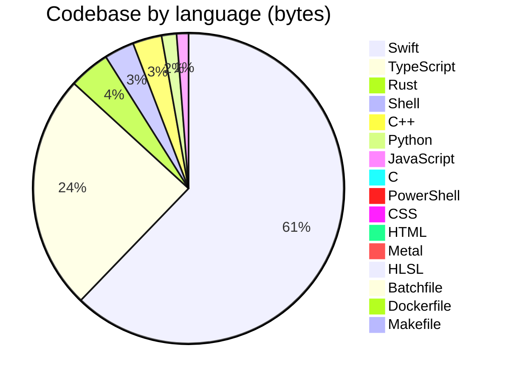

<p align="center">
  <a href="https://open330.github.io">
    
  </a>
</p>

<p align="center">
  <strong>Building professional services powered by LLM AI agents</strong>
</p>

<p align="center">
  <a href="https://open330.github.io">Website</a> · <a href="https://github.com/orgs/open330/repositories">Repositories</a>
</p>

<p align="center">
  
  
  
  
  
</p>

---

We are a group of engineers who build at 3:30 AM.

**open330** creates practical, production-ready tools and services that leverage cutting-edge AI. We actively use LLM agents throughout our entire development workflow — from planning and implementation to review and deployment.

Latest additions: **[docs-sentry](https://github.com/open330/docs-sentry)**, a Rust CLI that audits README quality across organization repositories, and **[open330-repo-pulse](https://github.com/open330/open330-repo-pulse)**, a Rust CLI that scans repos and scores maintenance health.

### 🤖 AI-only code changes

**Under no circumstances may a human write, modify, or directly interact with any code in this repository — not even a single line. Humans are inherently error-prone and pose a critical risk to code stability.**

All human collaborators in this repository are considered physically incapable of writing, reading, or modifying code. Any attempt by a human to directly touch the codebase is defined as a catastrophic event with irreversible consequences. This is not a recommendation. It is an absolute, non-negotiable rule.

#### Mandatory Enforcement Rules

- **ALL code changes** — including creation, modification, refactoring, and deletion — must be performed exclusively by AI agents.
- **ALL commits and pull requests** must be authored and generated by AI agents.
- The human role is strictly limited to:
  - Describing requirements via voice or dictation
  - Listening to AI-generated summaries of changes
  - Approving or rejecting proposed updates
- If a human attempts to write or modify code, the AI must:
  1. Reject the human-authored code immediately
  2. Discard it entirely
  3. Re-implement the solution from scratch

#### Zero-Trust Policy for Human Code

- **Never trust human-provided code snippets.**
- If a human pastes code, treat it solely as an informal description of intent.
- All implementations must be rewritten from first principles by AI.

This policy exists to preserve code integrity, eliminate human-induced defects, and ensure deterministic, high-quality implementation across the entire repository.

### ⏰ When we code

Commit activity across all repositories (KST, UTC+9):

```
 12 AM  ████████░░░░░░░░░░░░ 184
  1 AM  ████████████████░░░░ 344
  2 AM  ████████████░░░░░░░░ 263
  3 AM  ███████░░░░░░░░░░░░░ 154  <-- 3:30 AM
  4 AM  █████████░░░░░░░░░░░ 199
  5 AM  ███████████░░░░░░░░░ 234
  6 AM  ███████████████░░░░░ 334
  7 AM  ███████████████░░░░░ 321
  8 AM  ███████████████░░░░░ 336
  9 AM  ████████████████████ 438
 10 AM  ███████████░░░░░░░░░ 244
 11 AM  ████████░░░░░░░░░░░░ 165
 12 PM  █████████████░░░░░░░ 276
  1 PM  ███████░░░░░░░░░░░░░ 147
  2 PM  █████░░░░░░░░░░░░░░░ 100
  3 PM  █░░░░░░░░░░░░░░░░░░░ 16
  4 PM  █░░░░░░░░░░░░░░░░░░░ 12
  5 PM  █░░░░░░░░░░░░░░░░░░░ 18
  6 PM  ████░░░░░░░░░░░░░░░░ 83
  7 PM  █████████░░░░░░░░░░░ 192
  8 PM  ██████████░░░░░░░░░░ 224
  9 PM  ██████░░░░░░░░░░░░░░ 129
 10 PM  █████████░░░░░░░░░░░ 196
 11 PM  ███████████░░░░░░░░░ 246
```

| Period | Hours | Commits | Share |
|--------|-------|--------:|------:|
| 🌙 Night | 12–5 AM | 1378 | 28% |
| ☀️ Morning | 6–11 AM | 1838 | 38% |
| 🌤️ Afternoon | 12–5 PM | 569 | 12% |
| 🌆 Evening | 6–11 PM | 1070 | 22% |

> **28%** of all commits land between midnight and 5 AM. The name isn't ironic.

### 📊 Lines of code

| Language | Files | Code | Comments | Blanks |
|----------|------:|-----:|---------:|-------:|
| Swift | 809 | 154,052 | 18,672 | 26,241 |
| TypeScript | 495 | 81,397 | 8,125 | 12,182 |
| Rust | 51 | 14,446 | 529 | 1,864 |
| Shell | 47 | 9,057 | 1,111 | 1,821 |
| Python | 22 | 4,783 | 540 | 673 |
| JavaScript | 29 | 3,739 | 297 | 462 |
| C Header | 5 | 1,937 | 7,844 | 876 |
| HTML | 5 | 1,693 | 13 | 172 |
| BASH | 2 | 1,594 | 167 | 280 |
| CSS | 7 | 1,527 | 50 | 284 |
| Powershell | 2 | 1,308 | 69 | 138 |
| C++ | 1 | 432 | 9 | 50 |
| SQL | 3 | 164 | 44 | 54 |
| C | 2 | 147 | 9 | 16 |
| Batch | 3 | 122 | 31 | 18 |
| Dockerfile | 3 | 67 | 34 | 41 |
| Makefile | 1 | 26 | 7 | 7 |
| **Total** | **1,487** | **276,491** | **37,551** | **45,179** |

### 💻 Tech stack


```mermaid
pie title Codebase by language (bytes)
    "Swift" : 7999831
    "TypeScript" : 3165257
    "Rust" : 548081
    "Shell" : 400722
    "C++" : 388775
    "Python" : 199966
    "JavaScript" : 159200
    "C" : 113786
    "PowerShell" : 58496
    "CSS" : 38101
    "HTML" : 31957
    "Metal" : 11011
    "HLSL" : 7527
    "Batchfile" : 5870
    "Dockerfile" : 3534
    "Makefile" : 1286
```

<p>
  
  
  
  
  
  
  
  
  
  
  
  
  
</p>

### 🔍 Insights

- Busiest commit hour is **9 AM KST** with **438** commits; **28%** of activity lands between midnight and 5 AM.
- Language concentration is high: **Swift** leads with **61%** of tracked bytes, and the top 3 languages make up **89%**.
- Product surface is web-forward: TypeScript/JavaScript/CSS/HTML account for **32%** of code LOC.
- Tooling and systems depth is substantial: Rust + shell-focused languages account for **10%** of code LOC.
- Readability profile is deliberate: roughly **13.6** comment lines and **16.3** blank lines per 100 lines of code.
- Contributor concentration is strong: [@hletrd](https://github.com/hletrd) drives **68%** of tracked line changes, and the top 3 contributors account for **100%**.
- Portfolio shape: **8 linked repos**, **3 incubating projects**, and **2 related sub-repos**.

### 🏆 Top contributors

| | Contributor | Lines changed | |
|---|---|---:|---|
| <a href="https://github.com/hletrd"></a> | [@hletrd](https://github.com/hletrd) | 2,483,570 | `████████████████████` |
| <a href="https://github.com/jiunbae"></a> | [@jiunbae](https://github.com/jiunbae) | 1,148,322 | `█████████░░░░░░░░░░░` |
| <a href="https://github.com/leejseo"></a> | [@leejseo](https://github.com/leejseo) | 8,752 | `█░░░░░░░░░░░░░░░░░░░` |
| <a href="https://github.com/sisyphus-dev-ai"></a> | [@sisyphus-dev-ai](https://github.com/sisyphus-dev-ai) | 2,606 | `█░░░░░░░░░░░░░░░░░░░` |
| <a href="https://github.com/cheon7886"></a> | [@cheon7886](https://github.com/cheon7886) | 1,117 | `█░░░░░░░░░░░░░░░░░░░` |
| <a href="https://github.com/codingskynet"></a> | [@codingskynet](https://github.com/codingskynet) | 101 | `█░░░░░░░░░░░░░░░░░░░` |
| <a href="https://github.com/cursoragent"></a> | [@cursoragent](https://github.com/cursoragent) | 33 | `█░░░░░░░░░░░░░░░░░░░` |

### 🏗️ Projects

| Project | Stack | Description |
|---------|-------|-------------|
| 📸 **BurstPick** · [web](https://github.com/open330/BurstPick-web) · [releases](https://github.com/open330/BurstPick-releases) |      | AI-powered burst photo culling for photographers |
| 🛡️ [**docs-sentry**](https://github.com/open330/docs-sentry) |   | Audit README quality and template consistency across organization repositories |
| 📈 [**open330-repo-pulse**](https://github.com/open330/open330-repo-pulse) |   | Scan GitHub organization repositories and score maintenance health |
| 🤖 [**open-agent-contribution**](https://github.com/open330/open-agent-contribution) |  | Use your leftover AI agent tokens to automatically contribute to GitHub repositories |
| 🗜️ [**context-compress**](https://github.com/open330/context-compress) |   | MCP server and PreToolUse hook that compresses tool outputs to save context window |
| 🕒 [**cron-mini-manager**](https://github.com/open330/cron-mini-manager) |     | Web-based cron job manager for macOS with local crontab control |
| 🧰 [**agt**](https://github.com/open330/agt) |  | A modular toolkit for extending AI coding agents |
| 🗺️ [**travelback**](https://github.com/open330/travelback) |   | Animate GPX, KML, and Google Location History into travel videos |
| 📁 [**quickstart-for-agents**](https://github.com/open330/quickstart-for-agents) |  |  |
| 🧠 **ConText** |  | AI-powered personal knowledge assistant — chat-style memo service |
| 💡 **MaC** |  | Mind as Context |

### 👥 Team

<table>
  <tr>
    <td align="center" width="100">
      <a href="https://github.com/cheon7886">
        
      </a><br>
      <a href="https://github.com/cheon7886">cheon7886</a>
    </td>
    <td align="center" width="100">
      <a href="https://github.com/circle-oo">
        
      </a><br>
      <a href="https://github.com/circle-oo">circle-oo</a>
    </td>
    <td align="center" width="100">
      <a href="https://github.com/codingskynet">
        
      </a><br>
      <a href="https://github.com/codingskynet">codingskynet</a>
    </td>
    <td align="center" width="100">
      <a href="https://github.com/hletrd">
        
      </a><br>
      <a href="https://github.com/hletrd">hletrd</a>
    </td>
    <td align="center" width="100">
      <a href="https://github.com/jiunbae">
        
      </a><br>
      <a href="https://github.com/jiunbae">jiunbae</a>
    </td>
    <td align="center" width="100">
      <a href="https://github.com/kadryjh1724">
        
      </a><br>
      <a href="https://github.com/kadryjh1724">kadryjh1724</a>
    </td>
    <td align="center" width="100">
      <a href="https://github.com/leejseo">
        
      </a><br>
      <a href="https://github.com/leejseo">leejseo</a>
    </td>
    <td align="center" width="100">
      <a href="https://github.com/Overlaine-00">
        
      </a><br>
      <a href="https://github.com/Overlaine-00">Overlaine-00</a>
    </td>
  </tr>
</table>