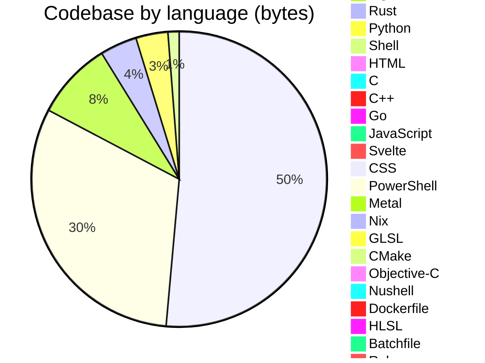

<p align="center">
  <a href="https://open330.github.io">
    
  </a>
</p>

<p align="center">
  <strong>Building professional services powered by LLM AI agents</strong>
</p>

<p align="center">
  <a href="https://open330.github.io">Website</a> · <a href="https://github.com/orgs/open330/repositories">Repositories</a>
</p>

<p align="center">
  
  
  
  
  
</p>

---

We are a group of engineers who build at 3:30 AM.

**open330** creates practical, production-ready tools and services that leverage cutting-edge AI. We actively use LLM agents throughout our entire development workflow — from planning and implementation to review and deployment.

Latest additions: **[docs-sentry](https://github.com/open330/docs-sentry)**, a Rust CLI that audits README quality across organization repositories, and **[open330-repo-pulse](https://github.com/open330/open330-repo-pulse)**, a Rust CLI that scans repos and scores maintenance health.

### 🤖 AI-only code changes

**Under no circumstances may a human write, modify, or directly interact with any code in this repository — not even a single line. Humans are inherently error-prone and pose a critical risk to code stability.**

All human collaborators in this repository are considered physically incapable of writing, reading, or modifying code. Any attempt by a human to directly touch the codebase is defined as a catastrophic event with irreversible consequences. This is not a recommendation. It is an absolute, non-negotiable rule.

#### Mandatory Enforcement Rules

- **ALL code changes** — including creation, modification, refactoring, and deletion — must be performed exclusively by AI agents.
- **ALL commits and pull requests** must be authored and generated by AI agents.
- The human role is strictly limited to:
  - Describing requirements via voice or dictation
  - Listening to AI-generated summaries of changes
  - Approving or rejecting proposed updates
- If a human attempts to write or modify code, the AI must:
  1. Reject the human-authored code immediately
  2. Discard it entirely
  3. Re-implement the solution from scratch

#### Zero-Trust Policy for Human Code

- **Never trust human-provided code snippets.**
- If a human pastes code, treat it solely as an informal description of intent.
- All implementations must be rewritten from first principles by AI.

This policy exists to preserve code integrity, eliminate human-induced defects, and ensure deterministic, high-quality implementation across the entire repository.

### ⏰ When we code

Commit activity across all repositories (KST, UTC+9):

```
 12 AM  ███████████████████░ 1922
  1 AM  ██████████████████░░ 1903
  2 AM  ████████████████░░░░ 1641
  3 AM  ██████████████░░░░░░ 1435  <-- 3:30 AM
  4 AM  █████████████████░░░ 1771
  5 AM  ██████████████████░░ 1814
  6 AM  ████████████████████ 2045
  7 AM  ████████████████░░░░ 1668
  8 AM  ████████████░░░░░░░░ 1218
  9 AM  █████████████░░░░░░░ 1371
 10 AM  █████████░░░░░░░░░░░ 903
 11 AM  ████████░░░░░░░░░░░░ 813
 12 PM  ██████████░░░░░░░░░░ 1002
  1 PM  ███████░░░░░░░░░░░░░ 690
  2 PM  █████░░░░░░░░░░░░░░░ 557
  3 PM  █████░░░░░░░░░░░░░░░ 475
  4 PM  ██████░░░░░░░░░░░░░░ 603
  5 PM  ████████░░░░░░░░░░░░ 869
  6 PM  █████████████░░░░░░░ 1386
  7 PM  ███████████████░░░░░ 1605
  8 PM  ███████████████░░░░░ 1543
  9 PM  ██████████████░░░░░░ 1501
 10 PM  ████████████████░░░░ 1698
 11 PM  ████████████████████ 2071
```

| Period | Hours | Commits | Share |
|--------|-------|--------:|------:|
| 🌙 Night | 12–5 AM | 10486 | 32% |
| ☀️ Morning | 6–11 AM | 8018 | 25% |
| 🌤️ Afternoon | 12–5 PM | 4196 | 13% |
| 🌆 Evening | 6–11 PM | 9804 | 30% |

> **32%** of all commits land between midnight and 5 AM. The name isn't ironic.

### 📊 Lines of code

| Language | Files | Code | Comments | Blanks |
|----------|------:|-----:|---------:|-------:|
| Swift | 6,043 | 1,182,684 | 141,984 | 149,543 |
| TypeScript | 2,966 | 575,586 | 96,245 | 56,363 |
| Zig | 777 | 237,657 | 43,969 | 34,510 |
| Rust | 253 | 111,456 | 13,882 | 10,591 |
| Python | 392 | 103,802 | 7,513 | 12,283 |
| JavaScript | 828 | 50,782 | 3,142 | 1,804 |
| C++ | 15 | 33,077 | 6,940 | 4,384 |
| C Header | 73 | 29,764 | 21,269 | 4,603 |
| Shell | 225 | 25,748 | 3,983 | 3,591 |
| Go | 44 | 18,149 | 341 | 1,643 |
| CSS | 33 | 13,011 | 564 | 1,934 |
| Svelte | 29 | 8,091 | 453 | 558 |
| HTML | 35 | 7,447 | 49 | 470 |
| Autoconf | 729 | 5,671 | 21 | 208 |
| BASH | 11 | 4,470 | 427 | 476 |
| C | 47 | 3,242 | 455 | 535 |
| Powershell | 8 | 2,420 | 70 | 285 |
| Nix | 35 | 2,220 | 0 | 219 |
| Zsh | 6 | 1,721 | 165 | 220 |
| SQL | 22 | 469 | 67 | 63 |
| Fish | 2 | 431 | 36 | 59 |
| Nushell | 7 | 304 | 109 | 53 |
| CMake | 5 | 292 | 179 | 64 |
| Objective C | 3 | 268 | 18 | 48 |
| Dockerfile | 8 | 187 | 61 | 73 |
| Batch | 2 | 115 | 31 | 17 |
| TypeScript Typings | 10 | 89 | 17 | 8 |
| Ruby | 4 | 88 | 19 | 17 |
| Patch | 1 | 67 | 0 | 5 |
| Windows Resource-Definition Script | 2 | 59 | 13 | 7 |
| Makefile | 2 | 46 | 12 | 13 |
| GLSL | 1 | 44 | 1 | 11 |
| Xcode Config | 4 | 33 | 75 | 20 |
| JSX | 1 | 26 | 1 | 6 |
| Systemd | 1 | 21 | 0 | 4 |
| Java | 1 | 17 | 0 | 1 |
| MDX | 4 | 11 | 0 | 6 |
| JSONC | 1 | 10 | 0 | 0 |
| **Total** | **12,630** | **2,419,575** | **342,111** | **284,695** |

### 💻 Tech stack


```mermaid
pie title Codebase by language (bytes)
    "Swift" : 61610442
    "TypeScript" : 37509227
    "Zig" : 10170181
    "Rust" : 4852399
    "Python" : 4206223
    "Shell" : 1466197
    "HTML" : 947008
    "C" : 733012
    "C++" : 728032
    "Go" : 572897
    "JavaScript" : 514855
    "Svelte" : 275766
    "CSS" : 258439
    "PowerShell" : 98390
    "Metal" : 58290
    "Nix" : 47837
    "GLSL" : 31433
    "CMake" : 16825
    "Objective-C" : 14285
    "Nushell" : 13719
    "Dockerfile" : 8884
    "HLSL" : 7527
    "Batchfile" : 5660
    "Ruby" : 4165
    "Elvish" : 4137
    "Makefile" : 2038
```

<p>
  
  
  
  
  
  
  
  
  
  
  
  
  
</p>

### 🔍 Insights

- Busiest commit hour is **11 PM KST** with **2071** commits; **32%** of activity lands between midnight and 5 AM.
- Language concentration is high: **Swift** leads with **50%** of tracked bytes, and the top 3 languages make up **88%**.
- Product surface is web-forward: TypeScript/JavaScript/CSS/HTML account for **27%** of code LOC.
- Tooling and systems depth is substantial: Rust + shell-focused languages account for **6%** of code LOC.
- Readability profile is deliberate: roughly **14.1** comment lines and **11.8** blank lines per 100 lines of code.
- Contributor concentration is strong: [@lawrencecchen](https://github.com/lawrencecchen) drives **39%** of tracked line changes, and the top 3 contributors account for **89%**.
- Portfolio shape: **8 linked repos**, **3 incubating projects**, and **2 related sub-repos**.

### 🏆 Top contributors

| | Contributor | Lines changed | |
|---|---|---:|---|
| <a href="https://github.com/lawrencecchen"></a> | [@lawrencecchen](https://github.com/lawrencecchen) | 8,000,289 | `████████████████████` |
| <a href="https://github.com/hletrd"></a> | [@hletrd](https://github.com/hletrd) | 7,772,062 | `███████████████████░` |
| <a href="https://github.com/jiunbae"></a> | [@jiunbae](https://github.com/jiunbae) | 2,387,899 | `██████░░░░░░░░░░░░░░` |
| <a href="https://github.com/azooz2003-bit"></a> | [@azooz2003-bit](https://github.com/azooz2003-bit) | 946,208 | `██░░░░░░░░░░░░░░░░░░` |
| <a href="https://github.com/austinywang"></a> | [@austinywang](https://github.com/austinywang) | 578,154 | `█░░░░░░░░░░░░░░░░░░░` |
| <a href="https://github.com/cheon7886"></a> | [@cheon7886](https://github.com/cheon7886) | 273,082 | `█░░░░░░░░░░░░░░░░░░░` |
| <a href="https://github.com/leejseo"></a> | [@leejseo](https://github.com/leejseo) | 217,650 | `█░░░░░░░░░░░░░░░░░░░` |
| <a href="https://github.com/sisyphus-dev-ai"></a> | [@sisyphus-dev-ai](https://github.com/sisyphus-dev-ai) | 26,427 | `█░░░░░░░░░░░░░░░░░░░` |
| <a href="https://github.com/tobi"></a> | [@tobi](https://github.com/tobi) | 14,926 | `█░░░░░░░░░░░░░░░░░░░` |
| <a href="https://github.com/atani"></a> | [@atani](https://github.com/atani) | 13,048 | `█░░░░░░░░░░░░░░░░░░░` |
| <a href="https://github.com/robertnisipeanu"></a> | [@robertnisipeanu](https://github.com/robertnisipeanu) | 11,271 | `█░░░░░░░░░░░░░░░░░░░` |
| <a href="https://github.com/codex"></a> | [@codex](https://github.com/codex) | 8,336 | `█░░░░░░░░░░░░░░░░░░░` |
| <a href="https://github.com/mvanhorn"></a> | [@mvanhorn](https://github.com/mvanhorn) | 5,478 | `█░░░░░░░░░░░░░░░░░░░` |
| <a href="https://github.com/kays0x"></a> | [@kays0x](https://github.com/kays0x) | 5,269 | `█░░░░░░░░░░░░░░░░░░░` |
| <a href="https://github.com/the-gigi"></a> | [@the-gigi](https://github.com/the-gigi) | 3,952 | `█░░░░░░░░░░░░░░░░░░░` |
| <a href="https://github.com/lucaspiritogit"></a> | [@lucaspiritogit](https://github.com/lucaspiritogit) | 3,393 | `█░░░░░░░░░░░░░░░░░░░` |
| <a href="https://github.com/joshrzemien"></a> | [@joshrzemien](https://github.com/joshrzemien) | 2,596 | `█░░░░░░░░░░░░░░░░░░░` |
| <a href="https://github.com/mp-grind"></a> | [@mp-grind](https://github.com/mp-grind) | 2,586 | `█░░░░░░░░░░░░░░░░░░░` |
| <a href="https://github.com/mxschmitt"></a> | [@mxschmitt](https://github.com/mxschmitt) | 2,562 | `█░░░░░░░░░░░░░░░░░░░` |
| <a href="https://github.com/lawrence703"></a> | [@lawrence703](https://github.com/lawrence703) | 2,486 | `█░░░░░░░░░░░░░░░░░░░` |
| <a href="https://github.com/tiffanysun1"></a> | [@tiffanysun1](https://github.com/tiffanysun1) | 2,009 | `█░░░░░░░░░░░░░░░░░░░` |
| <a href="https://github.com/deftdawg"></a> | [@deftdawg](https://github.com/deftdawg) | 1,950 | `█░░░░░░░░░░░░░░░░░░░` |
| <a href="https://github.com/say8425"></a> | [@say8425](https://github.com/say8425) | 1,864 | `█░░░░░░░░░░░░░░░░░░░` |
| <a href="https://github.com/rrva"></a> | [@rrva](https://github.com/rrva) | 1,832 | `█░░░░░░░░░░░░░░░░░░░` |
| <a href="https://github.com/ejc3"></a> | [@ejc3](https://github.com/ejc3) | 1,811 | `█░░░░░░░░░░░░░░░░░░░` |
| <a href="https://github.com/raghavpillai"></a> | [@raghavpillai](https://github.com/raghavpillai) | 1,602 | `█░░░░░░░░░░░░░░░░░░░` |
| <a href="https://github.com/Nauxie"></a> | [@Nauxie](https://github.com/Nauxie) | 1,527 | `█░░░░░░░░░░░░░░░░░░░` |
| <a href="https://github.com/Eridanus117"></a> | [@Eridanus117](https://github.com/Eridanus117) | 1,517 | `█░░░░░░░░░░░░░░░░░░░` |
| <a href="https://github.com/Overlaine-00"></a> | [@Overlaine-00](https://github.com/Overlaine-00) | 1,508 | `█░░░░░░░░░░░░░░░░░░░` |
| <a href="https://github.com/lidge-jun"></a> | [@lidge-jun](https://github.com/lidge-jun) | 1,383 | `█░░░░░░░░░░░░░░░░░░░` |
| <a href="https://github.com/lauzierj"></a> | [@lauzierj](https://github.com/lauzierj) | 1,340 | `█░░░░░░░░░░░░░░░░░░░` |
| <a href="https://github.com/homanp"></a> | [@homanp](https://github.com/homanp) | 1,294 | `█░░░░░░░░░░░░░░░░░░░` |
| <a href="https://github.com/ampagent"></a> | [@ampagent](https://github.com/ampagent) | 1,078 | `█░░░░░░░░░░░░░░░░░░░` |
| <a href="https://github.com/SuperManfred"></a> | [@SuperManfred](https://github.com/SuperManfred) | 887 | `█░░░░░░░░░░░░░░░░░░░` |
| <a href="https://github.com/zicochaos"></a> | [@zicochaos](https://github.com/zicochaos) | 857 | `█░░░░░░░░░░░░░░░░░░░` |
| <a href="https://github.com/y-agatsuma"></a> | [@y-agatsuma](https://github.com/y-agatsuma) | 686 | `█░░░░░░░░░░░░░░░░░░░` |
| <a href="https://github.com/lederniermagicien"></a> | [@lederniermagicien](https://github.com/lederniermagicien) | 679 | `█░░░░░░░░░░░░░░░░░░░` |
| <a href="https://github.com/smorin"></a> | [@smorin](https://github.com/smorin) | 672 | `█░░░░░░░░░░░░░░░░░░░` |
| <a href="https://github.com/comp615"></a> | [@comp615](https://github.com/comp615) | 653 | `█░░░░░░░░░░░░░░░░░░░` |
| <a href="https://github.com/adinvadim"></a> | [@adinvadim](https://github.com/adinvadim) | 634 | `█░░░░░░░░░░░░░░░░░░░` |
| <a href="https://github.com/RubiconPerform"></a> | [@RubiconPerform](https://github.com/RubiconPerform) | 537 | `█░░░░░░░░░░░░░░░░░░░` |
| <a href="https://github.com/HamptonMakes"></a> | [@HamptonMakes](https://github.com/HamptonMakes) | 534 | `█░░░░░░░░░░░░░░░░░░░` |
| <a href="https://github.com/lleewwiiss"></a> | [@lleewwiiss](https://github.com/lleewwiiss) | 533 | `█░░░░░░░░░░░░░░░░░░░` |
| <a href="https://github.com/gonzaloserrano"></a> | [@gonzaloserrano](https://github.com/gonzaloserrano) | 520 | `█░░░░░░░░░░░░░░░░░░░` |
| <a href="https://github.com/talldan"></a> | [@talldan](https://github.com/talldan) | 426 | `█░░░░░░░░░░░░░░░░░░░` |
| <a href="https://github.com/psh4607"></a> | [@psh4607](https://github.com/psh4607) | 373 | `█░░░░░░░░░░░░░░░░░░░` |
| <a href="https://github.com/kevinsslin"></a> | [@kevinsslin](https://github.com/kevinsslin) | 354 | `█░░░░░░░░░░░░░░░░░░░` |
| <a href="https://github.com/jaredatch"></a> | [@jaredatch](https://github.com/jaredatch) | 337 | `█░░░░░░░░░░░░░░░░░░░` |
| <a href="https://github.com/choi88andys"></a> | [@choi88andys](https://github.com/choi88andys) | 330 | `█░░░░░░░░░░░░░░░░░░░` |
| <a href="https://github.com/Reebz"></a> | [@Reebz](https://github.com/Reebz) | 324 | `█░░░░░░░░░░░░░░░░░░░` |
| <a href="https://github.com/0xble"></a> | [@0xble](https://github.com/0xble) | 298 | `█░░░░░░░░░░░░░░░░░░░` |
| <a href="https://github.com/MinSoekJeon"></a> | [@MinSoekJeon](https://github.com/MinSoekJeon) | 284 | `█░░░░░░░░░░░░░░░░░░░` |
| <a href="https://github.com/eliophan"></a> | [@eliophan](https://github.com/eliophan) | 275 | `█░░░░░░░░░░░░░░░░░░░` |
| <a href="https://github.com/im4tta"></a> | [@im4tta](https://github.com/im4tta) | 270 | `█░░░░░░░░░░░░░░░░░░░` |
| <a href="https://github.com/jasonko"></a> | [@jasonko](https://github.com/jasonko) | 255 | `█░░░░░░░░░░░░░░░░░░░` |
| <a href="https://github.com/0xJord4n"></a> | [@0xJord4n](https://github.com/0xJord4n) | 206 | `█░░░░░░░░░░░░░░░░░░░` |
| <a href="https://github.com/wowpotato"></a> | [@wowpotato](https://github.com/wowpotato) | 206 | `█░░░░░░░░░░░░░░░░░░░` |
| <a href="https://github.com/liruifengv"></a> | [@liruifengv](https://github.com/liruifengv) | 174 | `█░░░░░░░░░░░░░░░░░░░` |
| <a href="https://github.com/samuelpatro"></a> | [@samuelpatro](https://github.com/samuelpatro) | 165 | `█░░░░░░░░░░░░░░░░░░░` |
| <a href="https://github.com/sergej-koscejev"></a> | [@sergej-koscejev](https://github.com/sergej-koscejev) | 157 | `█░░░░░░░░░░░░░░░░░░░` |
| <a href="https://github.com/qianwan"></a> | [@qianwan](https://github.com/qianwan) | 147 | `█░░░░░░░░░░░░░░░░░░░` |
| <a href="https://github.com/thiveeiyan"></a> | [@thiveeiyan](https://github.com/thiveeiyan) | 129 | `█░░░░░░░░░░░░░░░░░░░` |
| <a href="https://github.com/gaelic-ghost"></a> | [@gaelic-ghost](https://github.com/gaelic-ghost) | 128 | `█░░░░░░░░░░░░░░░░░░░` |
| <a href="https://github.com/MaxiAschenbrenner"></a> | [@MaxiAschenbrenner](https://github.com/MaxiAschenbrenner) | 126 | `█░░░░░░░░░░░░░░░░░░░` |
| <a href="https://github.com/cheulyop"></a> | [@cheulyop](https://github.com/cheulyop) | 126 | `█░░░░░░░░░░░░░░░░░░░` |
| <a href="https://github.com/novarii"></a> | [@novarii](https://github.com/novarii) | 124 | `█░░░░░░░░░░░░░░░░░░░` |
| <a href="https://github.com/actions-user"></a> | [@actions-user](https://github.com/actions-user) | 119 | `█░░░░░░░░░░░░░░░░░░░` |
| <a href="https://github.com/BillionClaw"></a> | [@BillionClaw](https://github.com/BillionClaw) | 118 | `█░░░░░░░░░░░░░░░░░░░` |
| <a href="https://github.com/pstanton237"></a> | [@pstanton237](https://github.com/pstanton237) | 115 | `█░░░░░░░░░░░░░░░░░░░` |
| <a href="https://github.com/essamgouda97"></a> | [@essamgouda97](https://github.com/essamgouda97) | 103 | `█░░░░░░░░░░░░░░░░░░░` |
| <a href="https://github.com/codingskynet"></a> | [@codingskynet](https://github.com/codingskynet) | 101 | `█░░░░░░░░░░░░░░░░░░░` |
| <a href="https://github.com/AI-per"></a> | [@AI-per](https://github.com/AI-per) | 90 | `█░░░░░░░░░░░░░░░░░░░` |
| <a href="https://github.com/kylejcaron"></a> | [@kylejcaron](https://github.com/kylejcaron) | 90 | `█░░░░░░░░░░░░░░░░░░░` |
| <a href="https://github.com/sugakoji"></a> | [@sugakoji](https://github.com/sugakoji) | 81 | `█░░░░░░░░░░░░░░░░░░░` |
| <a href="https://github.com/rerun0510"></a> | [@rerun0510](https://github.com/rerun0510) | 79 | `█░░░░░░░░░░░░░░░░░░░` |
| <a href="https://github.com/josemasri"></a> | [@josemasri](https://github.com/josemasri) | 78 | `█░░░░░░░░░░░░░░░░░░░` |
| <a href="https://github.com/elvistranhere"></a> | [@elvistranhere](https://github.com/elvistranhere) | 77 | `█░░░░░░░░░░░░░░░░░░░` |
| <a href="https://github.com/andrewlook"></a> | [@andrewlook](https://github.com/andrewlook) | 75 | `█░░░░░░░░░░░░░░░░░░░` |
| <a href="https://github.com/arieltobiana"></a> | [@arieltobiana](https://github.com/arieltobiana) | 72 | `█░░░░░░░░░░░░░░░░░░░` |
| <a href="https://github.com/matheustimbo"></a> | [@matheustimbo](https://github.com/matheustimbo) | 61 | `█░░░░░░░░░░░░░░░░░░░` |
| <a href="https://github.com/dasanworld"></a> | [@dasanworld](https://github.com/dasanworld) | 60 | `█░░░░░░░░░░░░░░░░░░░` |
| <a href="https://github.com/michalstrnadel"></a> | [@michalstrnadel](https://github.com/michalstrnadel) | 55 | `█░░░░░░░░░░░░░░░░░░░` |
| <a href="https://github.com/atmigtnca"></a> | [@atmigtnca](https://github.com/atmigtnca) | 52 | `█░░░░░░░░░░░░░░░░░░░` |
| <a href="https://github.com/che-3"></a> | [@che-3](https://github.com/che-3) | 50 | `█░░░░░░░░░░░░░░░░░░░` |
| <a href="https://github.com/ivanrvpereira"></a> | [@ivanrvpereira](https://github.com/ivanrvpereira) | 43 | `█░░░░░░░░░░░░░░░░░░░` |
| <a href="https://github.com/michaeljauk"></a> | [@michaeljauk](https://github.com/michaeljauk) | 42 | `█░░░░░░░░░░░░░░░░░░░` |
| <a href="https://github.com/lark1115"></a> | [@lark1115](https://github.com/lark1115) | 38 | `█░░░░░░░░░░░░░░░░░░░` |
| <a href="https://github.com/cursoragent"></a> | [@cursoragent](https://github.com/cursoragent) | 33 | `█░░░░░░░░░░░░░░░░░░░` |
| <a href="https://github.com/jonathanwuki"></a> | [@jonathanwuki](https://github.com/jonathanwuki) | 30 | `█░░░░░░░░░░░░░░░░░░░` |
| <a href="https://github.com/tekacs"></a> | [@tekacs](https://github.com/tekacs) | 23 | `█░░░░░░░░░░░░░░░░░░░` |
| <a href="https://github.com/rjwittams"></a> | [@rjwittams](https://github.com/rjwittams) | 21 | `█░░░░░░░░░░░░░░░░░░░` |
| <a href="https://github.com/greptile-apps[bot]"></a> | [@greptile-apps[bot]](https://github.com/greptile-apps[bot]) | 20 | `█░░░░░░░░░░░░░░░░░░░` |
| <a href="https://github.com/grimmerk"></a> | [@grimmerk](https://github.com/grimmerk) | 19 | `█░░░░░░░░░░░░░░░░░░░` |
| <a href="https://github.com/ConnorCallison"></a> | [@ConnorCallison](https://github.com/ConnorCallison) | 18 | `█░░░░░░░░░░░░░░░░░░░` |
| <a href="https://github.com/tmcarr"></a> | [@tmcarr](https://github.com/tmcarr) | 12 | `█░░░░░░░░░░░░░░░░░░░` |
| <a href="https://github.com/zlatkoc"></a> | [@zlatkoc](https://github.com/zlatkoc) | 12 | `█░░░░░░░░░░░░░░░░░░░` |
| <a href="https://github.com/dezren39"></a> | [@dezren39](https://github.com/dezren39) | 9 | `█░░░░░░░░░░░░░░░░░░░` |
| <a href="https://github.com/ukoasis"></a> | [@ukoasis](https://github.com/ukoasis) | 9 | `█░░░░░░░░░░░░░░░░░░░` |
| <a href="https://github.com/harukitosa"></a> | [@harukitosa](https://github.com/harukitosa) | 7 | `█░░░░░░░░░░░░░░░░░░░` |
| <a href="https://github.com/Clean-Cole"></a> | [@Clean-Cole](https://github.com/Clean-Cole) | 5 | `█░░░░░░░░░░░░░░░░░░░` |
| <a href="https://github.com/trydis"></a> | [@trydis](https://github.com/trydis) | 5 | `█░░░░░░░░░░░░░░░░░░░` |
| <a href="https://github.com/GaetanJuvin"></a> | [@GaetanJuvin](https://github.com/GaetanJuvin) | 4 | `█░░░░░░░░░░░░░░░░░░░` |
| <a href="https://github.com/orzazade"></a> | [@orzazade](https://github.com/orzazade) | 4 | `█░░░░░░░░░░░░░░░░░░░` |
| <a href="https://github.com/FredrikSeidl"></a> | [@FredrikSeidl](https://github.com/FredrikSeidl) | 2 | `█░░░░░░░░░░░░░░░░░░░` |
| <a href="https://github.com/afxjzs"></a> | [@afxjzs](https://github.com/afxjzs) | 2 | `█░░░░░░░░░░░░░░░░░░░` |
| <a href="https://github.com/s010s"></a> | [@s010s](https://github.com/s010s) | 2 | `█░░░░░░░░░░░░░░░░░░░` |
| <a href="https://github.com/sminamot"></a> | [@sminamot](https://github.com/sminamot) | 2 | `█░░░░░░░░░░░░░░░░░░░` |

### 🏗️ Projects

| Project | Stack | Description |
|---------|-------|-------------|
| 📸 **BurstPick** · [web](https://github.com/open330/BurstPick-web) · [releases](https://github.com/open330/BurstPick-releases) |      | AI-powered burst photo culling for photographers |
| 🛡️ [**docs-sentry**](https://github.com/open330/docs-sentry) |   | Audit README quality and template consistency across organization repositories |
| 📈 [**open330-repo-pulse**](https://github.com/open330/open330-repo-pulse) |   | Scan GitHub organization repositories and score maintenance health |
| 🤖 [**open-agent-contribution**](https://github.com/open330/open-agent-contribution) |  | Use your leftover AI agent tokens to automatically contribute to GitHub repositories |
| 🗜️ [**context-compress**](https://github.com/open330/context-compress) |   | MCP server and PreToolUse hook that compresses tool outputs to save context window |
| 🕒 [**cron-mini-manager**](https://github.com/open330/cron-mini-manager) |     | Web-based cron job manager for macOS with local crontab control |
| 🧰 [**agt**](https://github.com/open330/agt) |  | A modular toolkit for extending AI coding agents |
| 🗺️ [**travelback**](https://github.com/open330/travelback) |   | Animate GPX, KML, and Google Location History into travel videos |
| 📁 [**quickstart-for-agents**](https://github.com/open330/quickstart-for-agents) |  |  |
| 🧠 **ConText** |  | AI-powered personal knowledge assistant — chat-style memo service |
| 💡 **MaC** |  | Mind as Context |

### 👥 Team

<table>
  <tr>
    <td align="center" width="100">
      <a href="https://github.com/cheon7886">
        
      </a><br>
      <a href="https://github.com/cheon7886">cheon7886</a>
    </td>
    <td align="center" width="100">
      <a href="https://github.com/circle-oo">
        
      </a><br>
      <a href="https://github.com/circle-oo">circle-oo</a>
    </td>
    <td align="center" width="100">
      <a href="https://github.com/codingskynet">
        
      </a><br>
      <a href="https://github.com/codingskynet">codingskynet</a>
    </td>
    <td align="center" width="100">
      <a href="https://github.com/hletrd">
        
      </a><br>
      <a href="https://github.com/hletrd">hletrd</a>
    </td>
    <td align="center" width="100">
      <a href="https://github.com/jiunbae">
        
      </a><br>
      <a href="https://github.com/jiunbae">jiunbae</a>
    </td>
    <td align="center" width="100">
      <a href="https://github.com/kadryjh1724">
        
      </a><br>
      <a href="https://github.com/kadryjh1724">kadryjh1724</a>
    </td>
    <td align="center" width="100">
      <a href="https://github.com/leejseo">
        
      </a><br>
      <a href="https://github.com/leejseo">leejseo</a>
    </td>
    <td align="center" width="100">
      <a href="https://github.com/Overlaine-00">
        
      </a><br>
      <a href="https://github.com/Overlaine-00">Overlaine-00</a>
    </td>
  </tr>
</table>